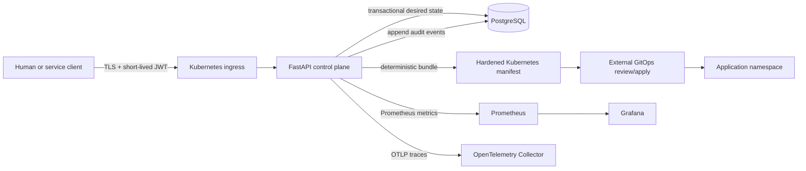

# Secure Cloud Infrastructure Platform

[](https://www.python.org/)
[](LICENSE)
[](infrastructure/)

A security-first reference control plane for authenticated, auditable container workload
specifications. It accepts only immutable image digests, applies role-and-scope authorization,
persists desired state with optimistic concurrency, and emits deterministic hardened Kubernetes
manifests for a GitOps deployment boundary.

This repository is an independently testable implementation by **Sham Satish Thakare**. It is
designed to show production engineering judgment without claiming that the included GCP stack has
been applied or that the software has served production traffic.

## Why this project exists

This repository turns a cloud-security portfolio concept into executable software with explicit
trust boundaries, reproducible infrastructure, and evidence-backed documentation.

## Problem

Cloud platforms often combine identity, workload admission, infrastructure, and operations in one
large trust domain. This project narrows the control plane deliberately:

- humans and service identities authenticate to a small FastAPI API;
- RBAC sets a maximum privilege level while explicit OAuth-style scopes narrow each token;
- every workload image must be pinned by `sha256` digest;
- state transitions and identity creation generate durable audit events;
- writes use database transactions and scale operations use compare-and-swap versions;
- the API renders hardened Deployment and Service resources, but has no Kubernetes credentials;
- a separate GitOps or release process reviews and applies those manifests.

That final boundary is intentional. A compromised API can propose desired state, but cannot directly
mutate the cluster.

## Architecture



The deployable API itself runs as an unprivileged, read-only container. The Helm chart disables
service-account token mounting, drops Linux capabilities, applies a default-deny NetworkPolicy,
requires a digest-pinned image, and expects runtime credentials from a pre-existing Secret.

See [architecture](docs/architecture.md), [threat model](docs/threat-model.md), and the
[design decisions](docs/adr/) for the rationale and trade-offs.

## Key Features

- separate human and service authentication with short-lived JWTs;
- role ceilings plus attenuated per-token scopes;
- transactional desired state and durable audit events;
- immutable workload images and deterministic hardened manifest output;
- compare-and-swap scaling that rejects stale writers;
- private-first GCP design and secure Kubernetes runtime defaults;
- metrics, traces, structured logs, health probes, dashboards, and automated security scans.

## Technical Highlights

The control plane intentionally cannot apply its generated manifests. This is the project's central
security property: the online API owns admission and desired state, while a separately authorized
GitOps process owns cluster mutation. Other notable choices are Argon2id credential hashing,
transaction-scoped auditing, typed Pydantic boundary models, async PostgreSQL access, and provider-
schema-validated infrastructure.

## Technology Stack

| Layer | Technology |
|---|---|
| API and validation | Python 3.12+, FastAPI, Pydantic v2 |
| Data and migrations | PostgreSQL 17, SQLAlchemy async, Alembic |
| Authentication | OAuth2 bearer flow, JWT, Argon2id, role-and-scope RBAC |
| Runtime | Docker, Compose, Kubernetes, Helm |
| Cloud infrastructure | Terraform, GCP, GKE, Cloud SQL, Artifact Registry, Secret Manager |
| Observability | Prometheus, Grafana, OpenTelemetry, structured JSON logs |
| Quality and security | pytest, Ruff, mypy, Bandit, pip-audit, CodeQL, Gitleaks, Trivy |

## Quick Start

Requirements: Docker with Compose v2, `curl`, `jq`, and OpenSSL.

```bash
make env
make demo
```

## Configuration

`.env.example` documents every local value. `make env` generates the sensitive values rather than
shipping defaults.

| Variable | Purpose | Production expectation |
|---|---|---|
| `SCIP_DATABASE_URL` | Async SQLAlchemy database URL | Private PostgreSQL connection with TLS |
| `SCIP_JWT_SIGNING_KEY` | HS256 signing secret | External secret delivery; at least 32 random characters |
| `SCIP_ALLOWED_HOSTS` | Trusted HTTP hostnames | Explicit DNS names; wildcard rejected |
| `SCIP_ACCESS_TOKEN_TTL_SECONDS` | JWT lifetime | 60–3600 seconds; default 900 |
| `SCIP_CORS_ORIGINS` | Browser origins | Empty unless a specific browser client is required |
| `SCIP_OTLP_TRACES_ENDPOINT` | OTLP/HTTP trace receiver | Internal collector endpoint |
| `SCIP_DOCS_ENABLED` | OpenAPI UI switch | Disabled |

## Demo

`make env` creates `.env` with mode `600` and cryptographically random local credentials. The demo
builds the API, migrates PostgreSQL, bootstraps an administrator, creates a digest-pinned desired
workload, scales it with optimistic concurrency, renders its Kubernetes bundle, and shows the audit
trail.

Local interfaces bind only to loopback:

- API and OpenAPI UI: `http://127.0.0.1:8000/docs`
- Prometheus: `http://127.0.0.1:9090`
- Grafana: `http://127.0.0.1:3000`

Stop services with `make compose-down`. Docker volumes are retained unless explicitly removed.

## API

| Method | Path | Minimum authorization | Purpose |
|---|---|---|---|
| `POST` | `/v1/auth/token` | Valid user credential | Issue a short-lived JWT |
| `POST` | `/v1/auth/service-token` | Valid service credential | Issue a scoped service JWT |
| `POST` | `/v1/users` | Admin + `identities:write` | Create a user |
| `POST` | `/v1/service-accounts` | Admin + `identities:write` | Create a one-time service secret |
| `GET` | `/v1/workloads` | Viewer + `workloads:read` | List active desired workloads |
| `POST` | `/v1/workloads` | Operator + `workloads:write` | Admit a digest-pinned workload |
| `GET` | `/v1/workloads/{id}/manifest` | Viewer + `workloads:read` | Render a hardened K8s bundle |
| `PATCH` | `/v1/workloads/{id}/scale` | Operator + `workloads:write` | Compare-and-swap replica count |
| `DELETE` | `/v1/workloads/{id}` | Admin + `workloads:delete` | Soft-delete desired state |
| `GET` | `/v1/audit-events` | Admin + `audit:read` | Read recent audit events |

Liveness, database-backed readiness, Prometheus metrics, and request-ID propagation are exposed at
`/health/live`, `/health/ready`, `/metrics`, and `X-Request-ID` respectively. Interactive API docs
are disabled by default in production.

## Architecture Decisions

The accepted ADRs cover the [manifest-only control plane](docs/adr/0001-manifest-only-control-plane.md),
[role-and-scope authorization](docs/adr/0002-role-and-scope-authorization.md), and
[external secret ownership](docs/adr/0003-secret-ownership.md). Each records the rejected coupling
and its operational consequence.

## Security

- Passwords and service secrets are hashed with Argon2id; plaintext service credentials are returned
  only once.
- JWT decoding fixes the allowed algorithm, validates issuer/audience/timestamps/required claims,
  rejects unknown claims, and prevents token scopes from exceeding the assigned role.
- Production configuration fails closed on SQLite, auto-created schemas, wildcard hostnames, or
  placeholder signing keys.
- Workload names are Kubernetes DNS labels and images must use immutable `@sha256:` references.
- State-changing operations share a transaction with their audit event.
- The API emits no secrets into rendered manifests and has no cluster mutation permission.
- The GCP design uses private GKE nodes, authorized control-plane networks, Workload Identity
  Federation, Dataplane V2, Shielded Nodes, Binary Authorization enforcement, a private encrypted
  Cloud SQL instance, and a least-privilege node identity.
- CI actions are pinned to commit SHAs. CodeQL, Gitleaks, Trivy, Bandit, and dependency auditing are
  configured as automated controls.

Security boundaries and remaining risks—including symmetric JWT key rotation, local-development
HTTP, denial-of-service limits, and the external GitOps trust boundary—are explicit in
[SECURITY.md](SECURITY.md) and [the threat model](docs/threat-model.md).

## Observability

The API emits bounded-cardinality HTTP counters and latency histograms, OTLP traces for FastAPI and
SQLAlchemy, request-correlated JSON logs, and separate liveness/readiness signals. Compose provisions
the collector, Prometheus, and a Grafana dashboard. Production alert starting points and data-
handling rules are in [docs/observability.md](docs/observability.md).

## Testing

Python 3.12+ and [`uv`](https://docs.astral.sh/uv/) are required.

```bash
make install
make check
```

The quality gate runs formatting/lint checks, strict mypy, unit and API integration tests with branch
coverage, Bandit, and an audit of the locked production dependency graph. Tests use an isolated
SQLite database for deterministic local execution. A PostgreSQL migration/lifecycle test runs when
`SCIP_TEST_POSTGRES_URL` is present; CI supplies a PostgreSQL 17 service. Alembic's full migration
round trip is independently validated.

Useful commands:

```bash
make format          # apply Python formatting
make migrate         # apply Alembic migrations to SCIP_DATABASE_URL
make run             # run the API from local environment variables
helm lint infrastructure/helm/scip --set image.repository=example/scip \
  --set image.digest=sha256:aaaaaaaaaaaaaaaaaaaaaaaaaaaaaaaaaaaaaaaaaaaaaaaaaaaaaaaaaaaaaaaa
```

## Production deployment path

1. Review and plan the [GCP Terraform stack](infrastructure/terraform/README.md) in an approved
   project. It does not create secret values and has not been applied from this repository.
2. Build the Dockerfile, scan the image, push it to Artifact Registry, and retain its digest.
3. Deliver `SCIP_DATABASE_URL` and `SCIP_JWT_SIGNING_KEY` through the organization's approved secret
   controller; do not put plaintext values in Terraform, Helm values, or Git.
4. Install the [Helm chart](infrastructure/helm/scip/README.md) with the immutable image digest, a
   real TLS secret, and environment-specific NetworkPolicy CIDRs.
5. Apply the migration Job before rolling the API, verify readiness/metrics/traces, and follow the
   [deployment and rollback runbook](docs/deployment.md).

## Repository map

```text
src/secure_cloud_platform/  API, security, persistence, telemetry, manifest builder
tests/                      unit and end-to-end API authorization tests
migrations/                 versioned Alembic schema
infrastructure/terraform/   validated GCP reference stack
infrastructure/helm/scip/   hardened Kubernetes deployment chart
observability/              Prometheus, Grafana, and OTel Collector configuration
docs/                       architecture, threat model, runbooks, and ADRs
.github/                    CI, security scans, dependency updates, contribution templates
```

## Benchmarks

No latency, throughput, cost, or efficiency number is published because no representative benchmark
or production rollout has been performed. The repository does not repeat the resume's historical
automation percentage as a measured result. A future benchmark must publish workload, hardware,
database state, concurrency, raw output, and statistical method.

## Roadmap

- asymmetric JWT signing with managed overlap/rotation and token revocation;
- signed GitOps promotion and Binary Authorization attestation policy;
- idempotency keys and cursor pagination for larger control-plane workloads;
- PostgreSQL-backed load, fault, and recovery tests with reproducible reports;
- centralized immutable audit export and disaster-recovery exercises.

## Research / Engineering Insights

The main engineering conclusion is that reducing credentials can be more valuable than adding an
automation layer. A control plane that returns deterministic artifacts is easier to review, replay,
and constrain than one holding direct cluster-admin access. Digest pinning provides immutability but
not publisher authenticity, so real deployment policy must pair it with signature/attestation
verification. Finally, role labels alone are insufficient for automation; scope attenuation makes
least privilege testable at each route.

## Engineering Status and Limitations

The repository is feature-complete for its stated reference scope. It is not a hosted service, a
general-purpose Kubernetes controller, or proof of a production SLA. No latency, throughput, cost,
or operational-efficiency claim is made because no representative benchmark or production rollout
has been performed. Redis was evaluated and omitted because the current transactional control-plane
path has no demonstrated caching, queuing, or distributed-locking requirement.

## License

Apache-2.0. See [LICENSE](LICENSE).

## Author

**Sham Satish Thakare** · [github.com/shamddd](https://github.com/shamddd)

Contributions follow [CONTRIBUTING.md](CONTRIBUTING.md).
