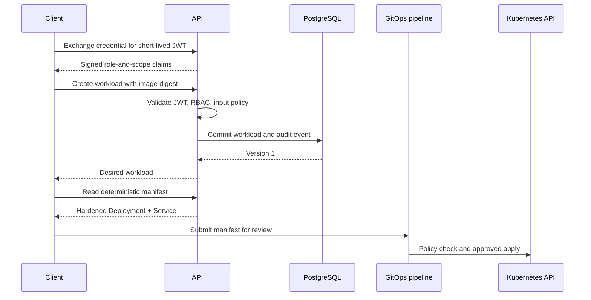
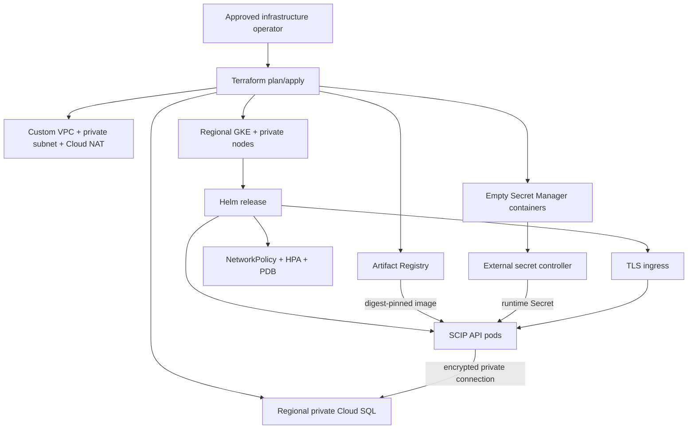
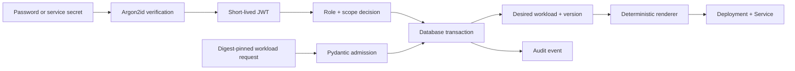

# Architecture

## Context and trust boundaries

The platform is a desired-state control plane, not a Kubernetes controller. Clients submit workload
intent to the API. The API validates identity, authorization, immutable image provenance, and
concurrency before persisting both state and its audit record in PostgreSQL. Authorized readers can
render a deterministic Kubernetes `List` containing a hardened Deployment and Service.

An external GitOps or release system owns cluster credentials, policy evaluation, review, and apply.
This separates an internet-reachable API from the cluster mutation plane.

## Components

### API

FastAPI provides explicit schemas, generated OpenAPI in non-production environments, dependency-
based authentication, and asynchronous request handling. The application-factory pattern keeps
configuration deterministic in tests and avoids import-time infrastructure access.

### Identity and authorization

Users and service accounts are separate subjects. The three roles are ordered `viewer < operator <
admin`; each defines a maximum scope set. A service identity can be narrowed below its role. Every
route declares both a minimum role and required scopes, preventing a broad role label from silently
overriding token attenuation.

### Persistence

SQLAlchemy async sessions are request-scoped transactions. Identity/workload mutations and audit
events commit together. Workloads carry an integer version; scaling updates only the expected
version and returns `409 Conflict` for stale callers. Deletion is logical to preserve history.

### Manifest boundary

The renderer is deterministic from stored desired state. It enforces read-only root filesystems,
non-root execution, RuntimeDefault seccomp, dropped capabilities, bounded resources, disabled
service-account token mounting, and ClusterIP-only exposure. It never accepts arbitrary manifest
fragments or secret values.

### Telemetry

JSON logs include request IDs, method, path, and duration but not credentials or bodies. Prometheus
captures request counts and latency histograms. OpenTelemetry traces export through OTLP/HTTP to a
collector. PostgreSQL readiness is separate from process liveness.

## Deployment topologies

The Compose topology is a repeatable local integration environment with PostgreSQL, Prometheus,
Grafana, and an OpenTelemetry Collector. Host ports bind to loopback and the database is not
published.

The GCP reference topology uses regional GKE, private worker nodes, Cloud NAT, a private regional
Cloud SQL instance, Artifact Registry, and empty Secret Manager containers. Terraform owns durable
cloud infrastructure; Helm owns Kubernetes objects; an external secret controller owns secret
material.

## Data flow

## Data model

| Entity | Purpose | Sensitive fields |
|---|---|---|
| User | Human username, Argon2id hash, role, disabled state | Password hash |
| ServiceAccount | Client ID, one-way secret hash, role and narrowed scopes | Secret hash |
| Workload | Digest-pinned image, replicas, port, version, lifecycle status | None by design |
| AuditEvent | Actor, action, resource identity, non-secret details, timestamp | Operational metadata |

No plaintext credential is stored. Audit details intentionally exclude access tokens, request
bodies, password material, and service secrets.
