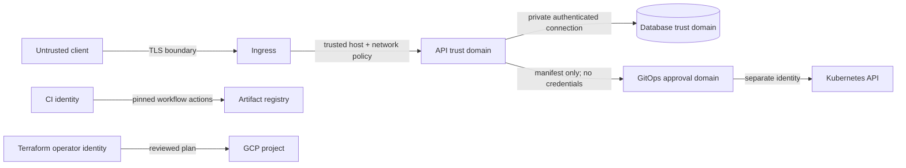

# Threat model

This model covers the repository's control plane and reference deployment. It does not transfer to
an organization unchanged; operators must add their identity provider, GitOps system, ingress,
certificate, DNS, and organization-policy threats.

## Assets

- JWT signing key and database connection credential
- password and service-secret hashes
- authorization assignments and workload desired state
- immutable image digests and generated manifests
- audit events and telemetry
- Terraform state and cloud resource identities

## Trust boundaries

1. Untrusted client to TLS ingress
2. Ingress to API pod
3. API to PostgreSQL and OTel collector
4. Manifest response to external GitOps review and cluster apply
5. Terraform operator to Google Cloud APIs and remote state
6. CI runner to source, dependency registries, and artifact registry

## Threats and controls

| Threat | Preventive/detective controls | Residual risk |
|---|---|---|
| Credential guessing | Argon2id, generic authentication failure, short JWT lifetime, ingress rate-limit recommendation | The app does not implement a distributed lockout; enforce at gateway/IdP |
| JWT forgery or confusion | Strong configured key, fixed HS256 algorithm, issuer/audience/time/claim validation, scope-to-role check, key ID | Symmetric key rotation is manual; existing tokens are valid until expiry |
| Privilege escalation | Route-level minimum role and explicit scope, service-scope attenuation, deny-by-default errors, authorization tests | Administrators can create privileged identities by design |
| Mutable/surprise workload | Required sha256 image digest, constrained DNS names/ports/replicas, no arbitrary Kubernetes fragments | Digest integrity does not prove publisher identity; admission must verify signatures |
| Lost update | Compare-and-swap workload version and `409` on stale scale | Create/delete do not expose idempotency keys |
| Audit bypass | Mutation and audit event share one database transaction | A database administrator can alter records; export to immutable logging for production |
| Cluster takeover from API | No Kubernetes client or mounted service-account token; manifest-only handoff | GitOps credentials and approval policy remain an external critical boundary |
| Container escape | Non-root UID, read-only root, seccomp, dropped capabilities, no privilege escalation, resource bounds | Kernel/runtime vulnerabilities remain; patch nodes and scan images |
| Lateral movement | Default-deny Kubernetes NetworkPolicy with explicit ingress/egress, private database | Example CIDRs must be narrowed; network policy support depends on CNI |
| Secret disclosure | No secret values in Terraform/Helm/Git, secrets masked by types, logs exclude bodies/tokens | Process environment and Kubernetes Secret access require platform hardening |
| Supply-chain compromise | Locked Python graph, digest-required application image, pinned CI actions, CodeQL/Gitleaks/Trivy/Bandit/audit workflows | Base/third-party image tags in local Compose are versioned but not digest-pinned |
| Availability exhaustion | Replica/HPA/PDB settings, resource limits, DB health checks, bounded input and list limit | No application-level rate limiter or queue; rely on ingress and load testing |
| Terraform operator error | Validated variables, plan-before-apply runbook, deletion protection, private defaults | Incorrect project/CIDR/tier can still create cost or connectivity impact |

## Security invariants tested in CI

- a viewer cannot write workloads;
- a narrowed service identity cannot gain write access;
- mutable image tags fail validation;
- stale workload versions cannot overwrite newer state;
- expired or invalid credentials fail closed;
- rendered containers drop all capabilities and use immutable images;
- production configuration rejects insecure database, host, migration, and key settings.

## Recommended production additions

- replace local credentials with workload identity and an external OIDC provider;
- use asymmetric signing keys in KMS with automated overlap/rotation and token revocation;
- require signed images through Binary Authorization policy, not only digest references;
- export audit events to append-only centralized storage with retention alerts;
- enforce gateway rate limits, request-size limits, WAF policy, and abuse monitoring;
- add disaster-recovery exercises, representative load tests, and dependency/image SBOM signing.
